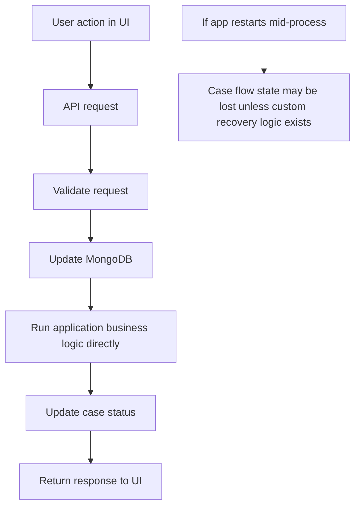
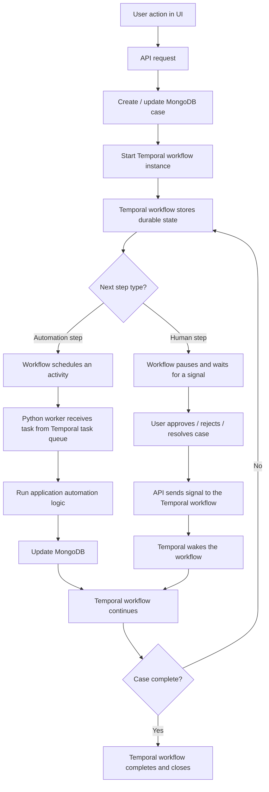
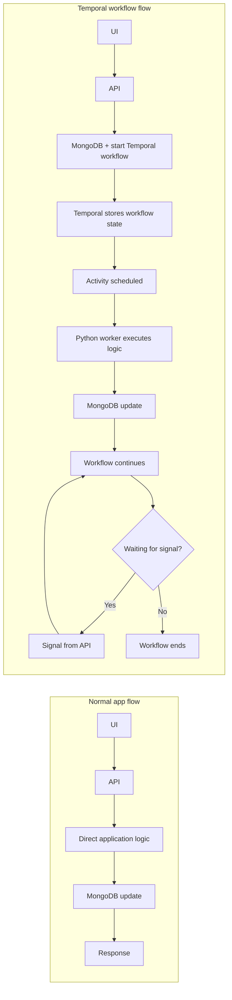
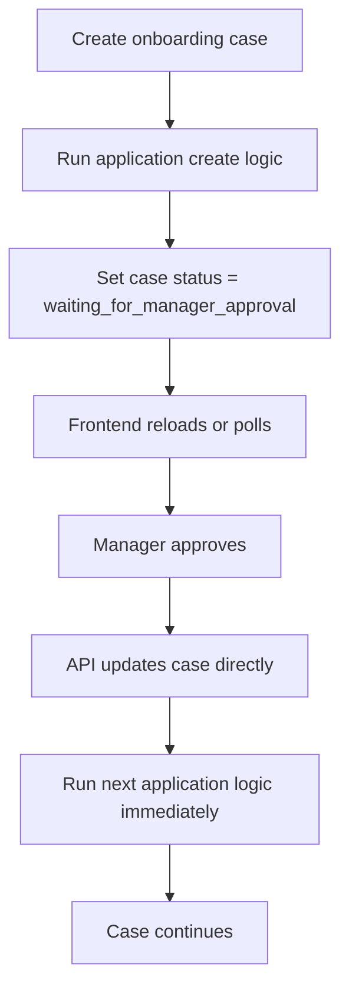
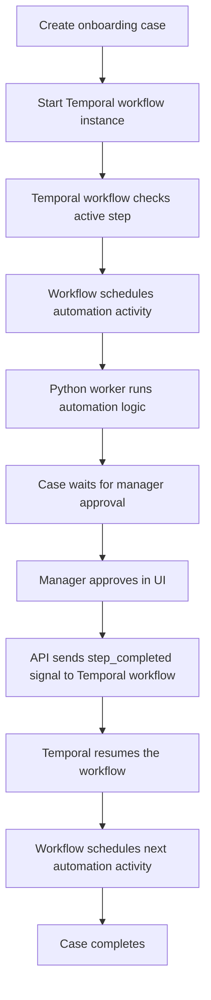

# Temporal vs Normal Flow Diagrams

## Important terminology

There are two different things in this project:

1. The application-level case workflow
   - this is the business process for a case
   - example: onboarding, approval, resolution, assignment, escalation
   - this is not a Temporal concept by itself; it is the case lifecycle logic in the application

2. The Temporal workflow
   - this is the durable orchestration engine provided by Temporal
   - it tracks execution state, waits on signals, schedules activities, and resumes after delays or restarts

When we say "workflow" in this project, we should be precise:

- "case workflow" or "business workflow" = the process of the case moving through stages/steps
- "Temporal workflow" = the runtime engine that coordinates that process

---

## 1) Normal non-Temporal flow diagram

### Explanation

This is the simplest flow:

- request enters API
- application logic executes immediately
- DB is updated directly
- response is returned immediately
- if the server restarts, the in-progress case state is not automatically recovered by a workflow engine

This is a normal application flow, not a Temporal workflow.

---

## 2) Temporal flow diagram

### Explanation

This is the durable orchestration flow driven by Temporal:

- the Temporal workflow persists the process state
- the worker executes the actual Python logic via activities
- human decisions arrive as signals
- the workflow resumes when the signal arrives
- timeout, retry, and restart behavior are handled by Temporal

This is not the same as the app's own case business flow; it is the Temporal engine running the orchestration for that flow.

---

## 3) Side-by-side visual comparison

---

## 4) Example use case: onboarding approval

### Normal app flow

### Temporal workflow flow

---

## 5) Key difference in plain English

### Normal app flow

The application itself performs the steps in sequence.

### Temporal workflow

The Temporal engine persists the workflow state and coordinates execution, while the Python worker runs the actual logic for each activity.

---

## Final takeaway

- Normal app flow = direct execution in the application
- Temporal workflow = durable orchestration engine that coordinates execution and waits for signals
- Case workflow = the business process itself
- Temporal workflow = the runtime mechanism that runs and manages that process

When we refer to a workflow in this app, the clearest terms are:

- "case workflow" for the business process
- "Temporal workflow" for the runtime workflow engine
